# Exercise 8 - Page Map: Adding a Controller Extension

In this exercise we will learn how to change the **edit flow** of an app by implementing a controller extension for the object page with support of the Page Map.\
In order to promote the new **green flight offering**, we will intercept the **save action** by overriding function **onBeforeSave** of the\
**edit flow API**, and execute some custom code in order to check whether Trees-4-Tickets has been selected for the travel.\
Additionally, we will make usage of the **form element building block** in order to display a form in a save dialog.

(1) For further details, the Flexible Programming Model Explorer provides detailed [guidance](https://ui5.sap.com/test-resources/sap/fe/core/fpmExplorer/index.html#/controllerExtensions/controllerExtensionsOverview/guidanceControllerExtensions) on how to register and implement a controller extension.


## Exercise 8.1 - Using the Page Map to Add a Controller Extension

(2) In the Application Studio toolbar, click the SAP Fiori icon .

(3) Click   to open the Page Map.

(4) On the **object page** tile click icon **Show Controller Extensions** .


The Page Map supports the creation of controller extensions overriding all object page controllers globally, or only specific object page instances.\
We will create a specific controller extension for our travel object page.

(5) Click .

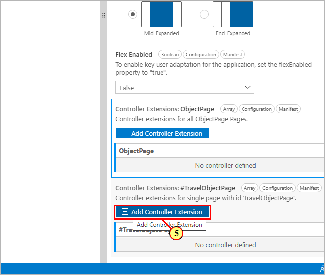

The **Add Controller Extension Dialog** is opened.

(6)  Insert **ObjectPageExtension** as **Controller Name**. (7) Confirm by clicking .

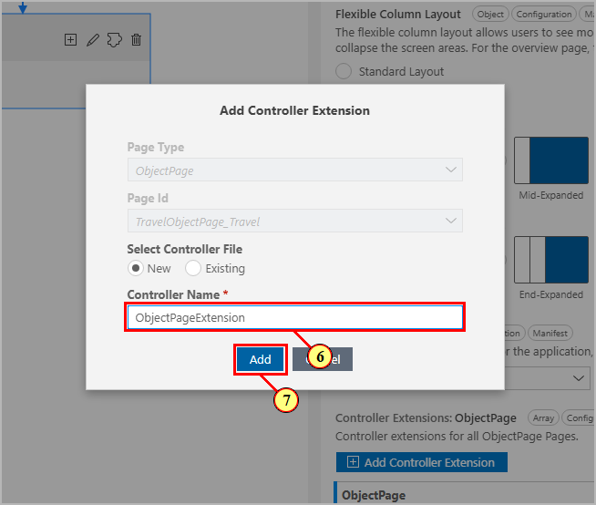

(8) Open file **app/manifest.json**.\
(9) Scroll to section **extends** where the controller extension is defined.\
Please note how the specific instance of the object page controller is overridden:\
the ID is constructed by using the pattern **YourApplicationID::ComponentID**.

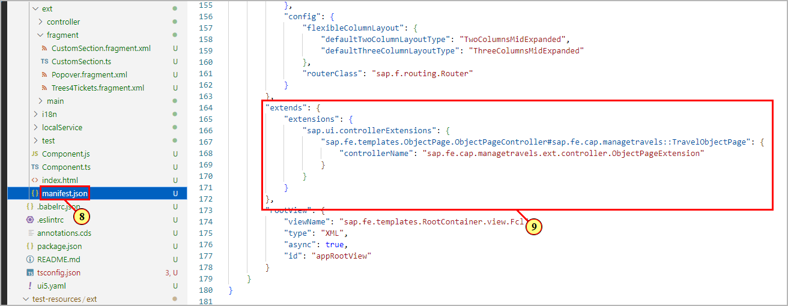

(10) Click **Edit in source code**  to open up the generated controller extension file.

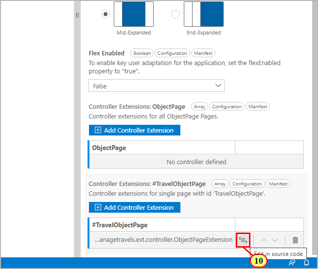

(11) In the controller file, below function **onInit()** add the following code which overrides the **editFlow API** function [**onBeforeSave**](https://ui5.sap.com/#/api/sap.fe.core.controllerextensions.EditFlow%23methods/onBeforeSave) to intercept the save action. The framework waits for the returned promise to be resolved before continuing the 'Save' action. If you reject the promise, the 'Save' action is stopped and the user stays in edit mode. Inside the returned promise, a save dialog shall be instantiated:

```ts
,
		editFlow: {
			onBeforeSave(this: ObjectPageExtension) {
				const context = this.base
					.getExtensionAPI()
					.getBindingContext() as Context;
				if (!context.getProperty("GoGreen")) {
					//void intentionally discards returned floating promise
					return new Promise<null>((resolve, reject) => { void this.openDialog(resolve, reject, context); })
				}
			}
		}
```

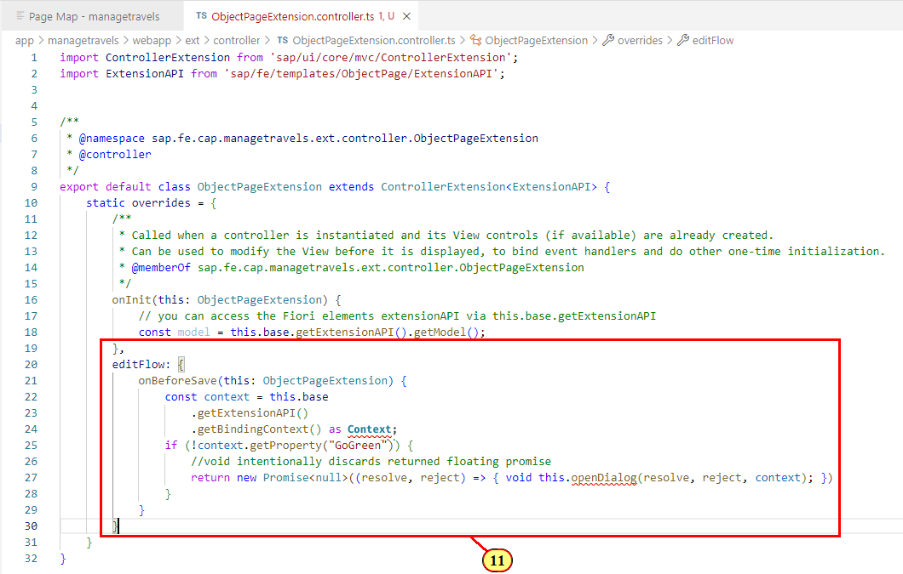


For more examples on overriding the edit flow API, you can check the [Flexible Programming Model Explorer](https://sapui5.hana.ondemand.com/test-resources/sap/fe/core/fpmExplorer/index.html#/controllerExtensions/controllerExtensionsOverview/basicExtensibility).

(12) Let's take care of the syntax error shown at method **openDialog**. Hover the mouse over it. The popover shows that the method does not exist. Click .


(13) Select .

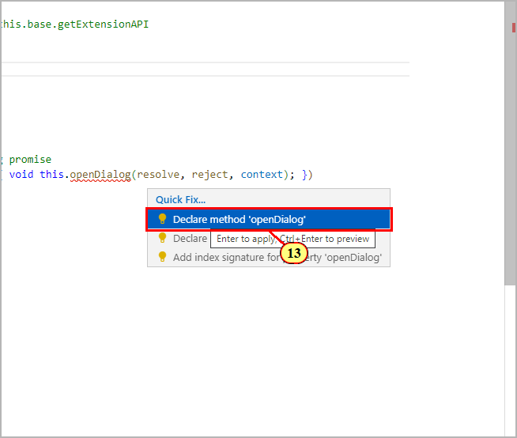

(14) The method stub is created..


(15) Replace code line  with the following code snippet:

```ts
		//try catch ensures errors in floating promises are handled properly
		try {
			let approveDialog: Dialog;
			approveDialog = (await this.base.getExtensionAPI().loadFragment({
				id: "myFragment",
				initialBindingContext: context,
				name: "sap.fe.cap.managetravels.ext.fragment.Trees4Tickets"
			})) as Dialog;
			//Dialog Save button
			approveDialog.getBeginButton().attachPress(function(){
				approveDialog.close().destroy();
				resolve(null);
			})
			//Dialog Cancel button
			approveDialog.getEndButton().attachPress(function(){
				approveDialog.close().destroy();
				reject(null);
			})			
			//consider dialog closing with ESC
			approveDialog.attachAfterClose(function () {
				approveDialog.destroy();
				reject(null);
			});			
			approveDialog.open();
		} catch (error) {
			reject(null);
		}
```

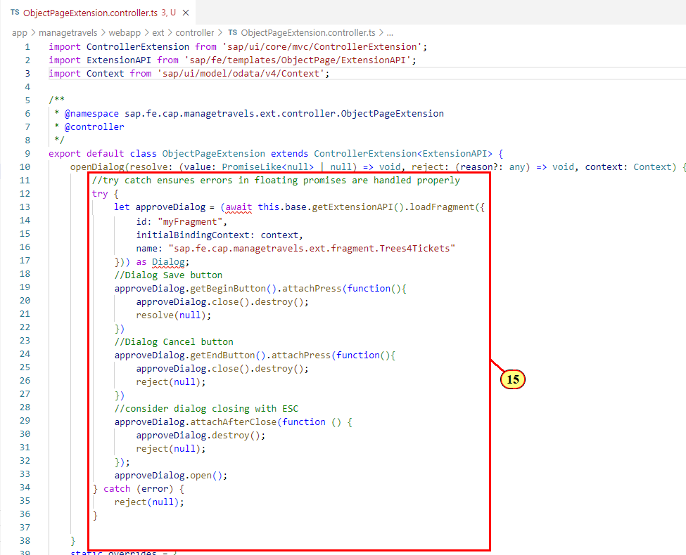

(16) Let's fix some more eslint errors. Hover over **Dialog** and click  to add the missing import statement.

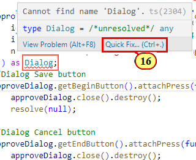

(17) Hover over **await** and click .

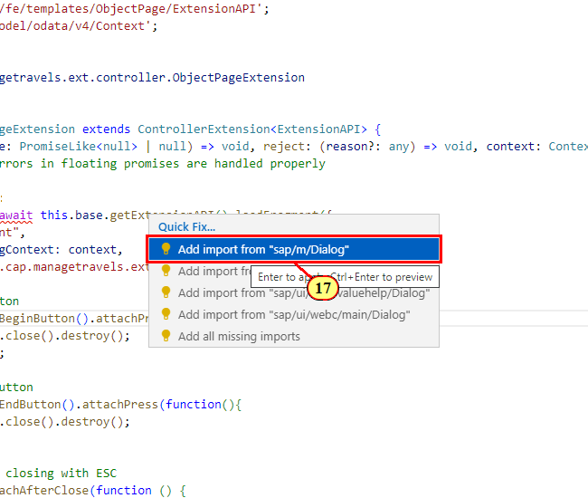

(18) The popover informs informs that **await** statements are only allowed in containing async function. Click .


(19) Select .

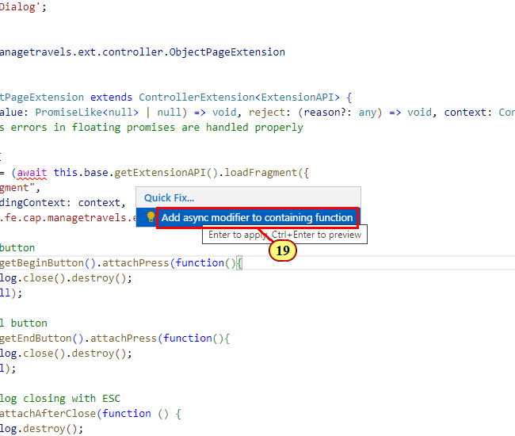

## Exercise 8.2 Move XML Fragment to App Folder

The **xml fragment** containing the dialog definition is provided with the project.\
We need to move it to the corresponding app's sub folder in order to make usage of it:

Open project folder **app/test-resources/ext/fragment**.\
Drag and drop file **Trees4Tickets.fragment.xml** (20) to folder **app/managetravels/webapp/ext/fragment** (21).


(22) Confirm by clicking .


(23) The XML fragment  defines a dialog containing some UI5 controls and two buttons for saving and canceling.\
The most interesting part is the **form element building block** used in (24) and (25).
- with property **metaPath** pointing to a property of the current binding context, we can show the property as a form field, having the same behaviour as a standard field.
- property **visible** shows and hides the form elements depending on the property path value. We are using boolean property **GoGreen** for that purpose, which is set when the checkbox is selected.

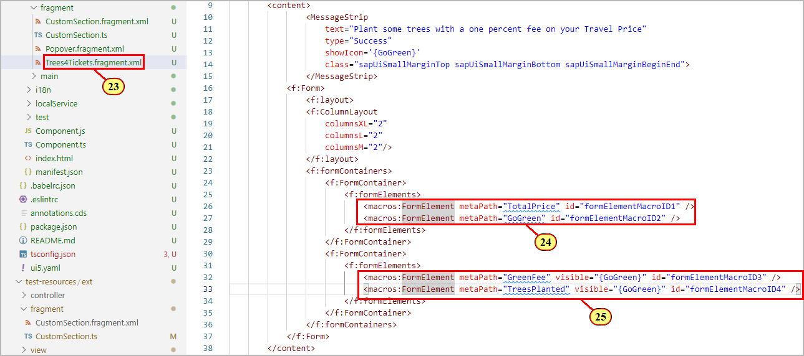

## Exercise 8.3 - Testing the Controller Extension

(26) Switch to the preview browser tab and click .


(27) Make sure that the **Trees-4-Tickets** flag is not set in the sustainability field group, then press  .


The dialog is shown.\
(28) Select check box **Trees-4-Tickets**.\
the draft is automatically updated in the background.

(29) Additional form fields with updated data are shown.

(30) Click .

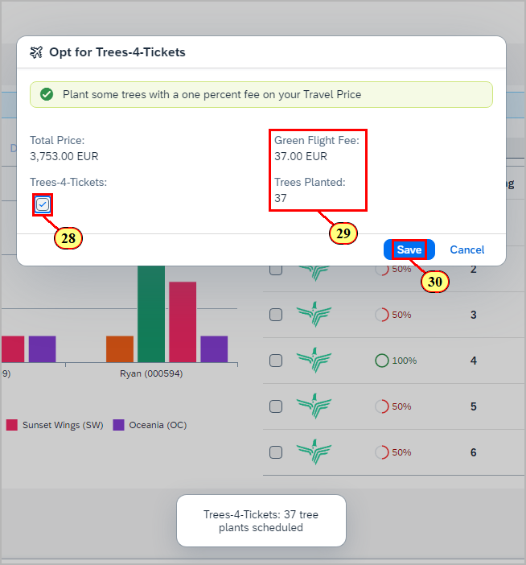

(31) The object is saved and the UI switches back to display mode.

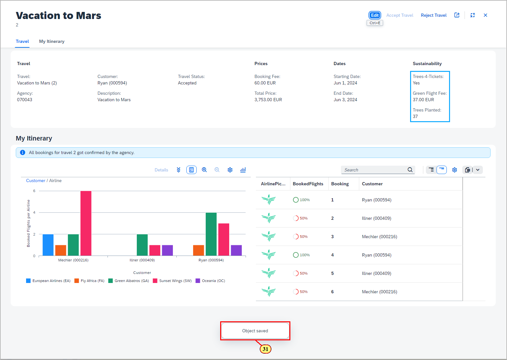

## Summary

You've now successfully completed the hands-on workshop. Congratulations!